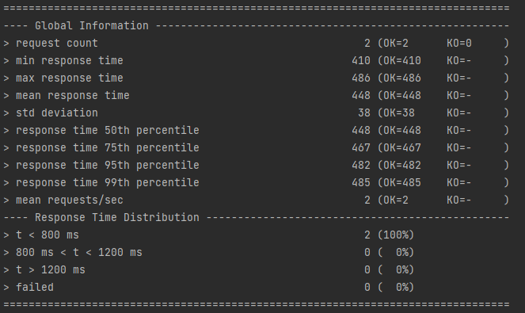

# aw04-report

## Task 1

**request count**:200

## Task 2

I start 4 0.5-cpu dockers. And I used gatling to perform a load testing on them.

**request count**:2

**request count**:20

**request count**:200

As the screenshots show, the mean response time increases as the request count increases.

And we can find that when the request count equals 200, the mean response time is smaller in task 2 than in task 1(2704<3021). So the horizontal expansion does take effect.

## Task 3

### Cache

I make a cluster with 6 nodes, 3 master nodes 3 slave nodes.

I observed that the JD data have been successfully stored in the redis database. When I refresh the webpage, the time is so fast. And the cached data are stored in 30002 master server.

When cache missing, `JD.getProducts` function can be executed.

**Load testing**:

When 'EnableCaching' annotation is deleted:

When 'EnableCaching' annotation is set:

Obviously, the cache has taken effect because the mean response time decrease a lot.

### Session
Make the cart stored in the http session object.

